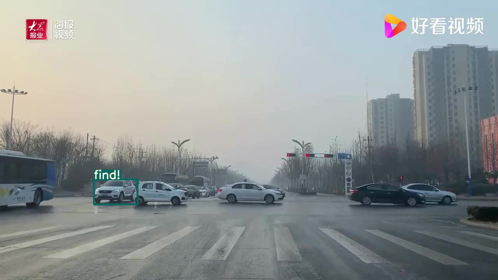

# yolov5+reid

该项目可用于做reid识别，可用于做**跨视频车辆识别**

reid网络采用resnet50_ibn_a（权重需要和defaults.py中的MODEL.NAME对应），支持se_resnext50网络。权重见文末百度盘链接。

:electric_plug:注意：

该项目<u>没有将yolov5训练加入</u>，只是将检测功能和reid进行了整理。

**vehicle_search下只进行检测**，不进行reid的训练，reid的训练在yolov5_vehicle_reid中。

# 从视频中获取想要检测的车(待检测车辆)

```shell
python get_query.py
```

可从弹出的视频中利用鼠标框选待检测的车辆。

操作方法：

​		运行程序后用鼠标左键从目标左上角进行框选，按“空格”键继续播放视频(会自动把框选的图像进行保存)

该车辆图像会保存在query文件夹中，**默认命名格式为veri**。

ps:也可以直接将图像放在query文件中，但名字也需要按veri命名。


# 车辆查找

检测：将 **训练好的reid权重**放在:ear:**vehicle/weights**文件下，yolov5s.pt放**vehicle_search**下 

**修改reid/config/defaults.py中的_C.TEST.WEIGHT为reid权重路径**

参数说明：

--weights: yolov5权重路径

--source: video/file/ path

--data: data/coco128.yaml

--imgsz: 输入图像大小，默认(640,640)

--conf_thres:置信度阈值

--iou_thres:iou阈值

--classes:过滤的类

--half:半精度推理

--dist_thres:reid对比的距离阈值(**<u>小于</u>该阈值判断为同一个车**)

--save_res:保存视频图像

```shell
python search.py --weights yolov5s.pt --source car.mp4 --dist_thres 1
```

如果需要检测视频或者多视频(跨视频检测)，需要指定source路径。

<p align="center">
    </img>
</p>